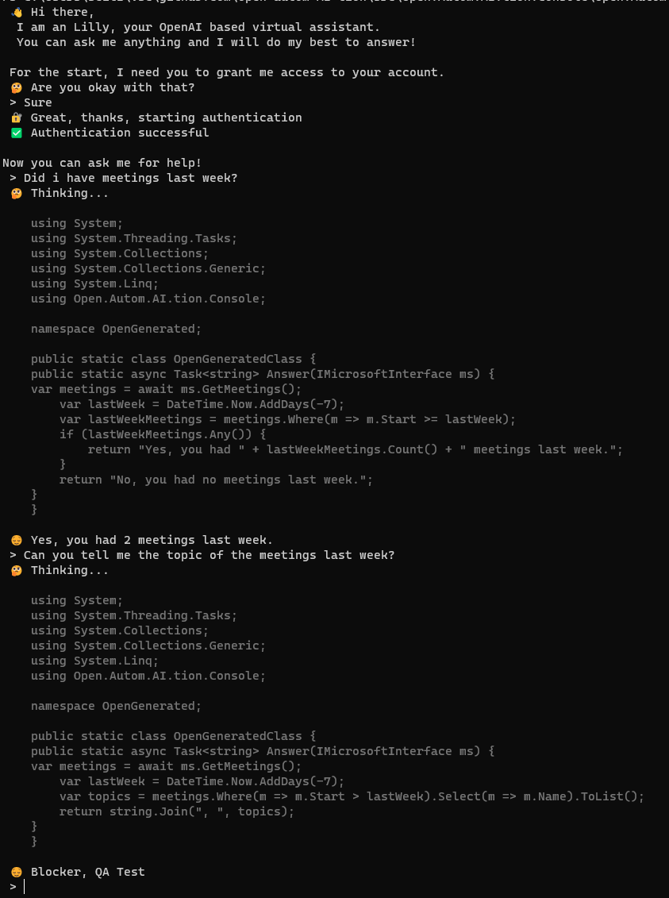

# open autom-AI-tion

## What is this?
This repositories has the following three targets:
1. Play with OpenAIs LLMs
2. Test the [Azures OpenAI services](https://learn.microsoft.com/en-us/azure/cognitive-services/openai/overview)
3. Develop me an automation for my daily work

## What is the vision?

So I would like to chattify some of my daily tasks. The ones that I find most annoying - like setting up meetings. I know, MS is planning to do this with their Copilot for Office 365, however a universal solution that works with MS and Google & Co. seems nice to me.

## How does it work (for now)?
So the thing is that I don't know if I am allowed to plug my company data like meetings, emails into OpenAIs LLMs. Furthermore I feel no urge to talk to our data protection unit (*surprise*).

Therefore, I choose to use code generation with the `code-davinci-02` model. The task for the LLM is to generate code that answers my questions **- or -** performs the task I ask for.

## How capable is it?

There is a lot work to do, however it turns out you can archive a lot pretty fast.

## What do I need to use it?

Currently you need an **M365 tenant** and access to the **Azure Open AI Services** ...besides the .NET 7 SDK etc.